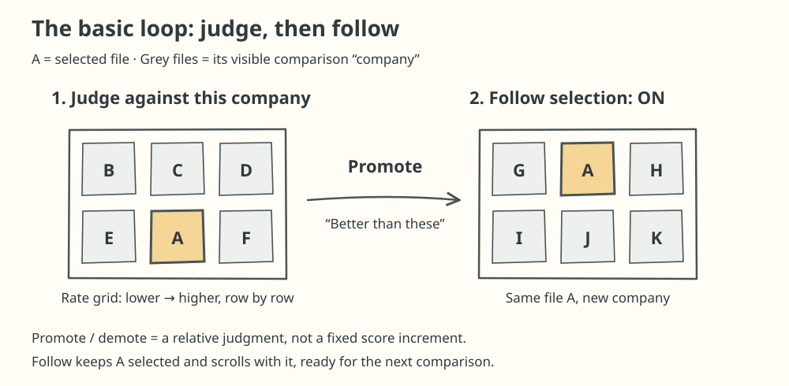
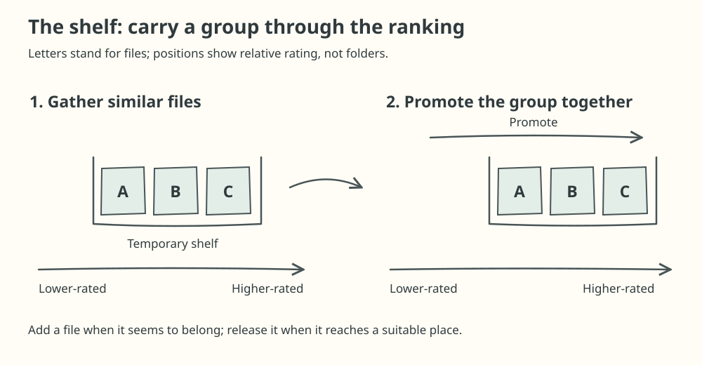
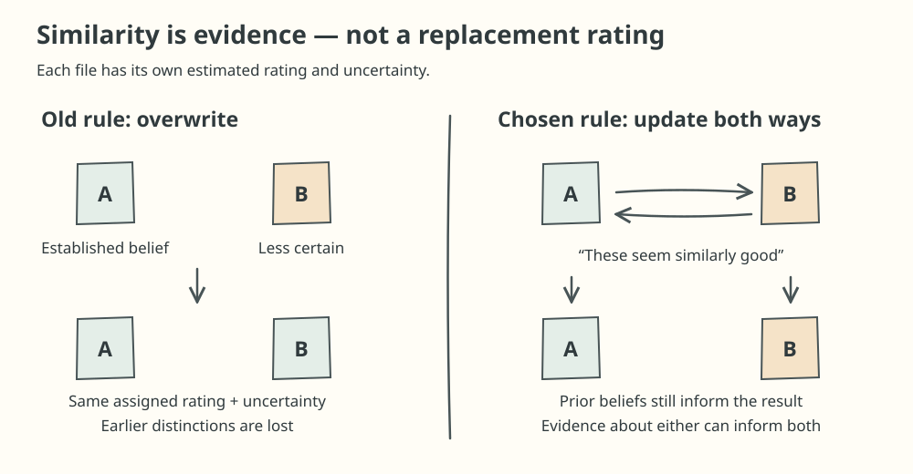

# nrank: making grouped ratings preserve prior judgments

[Back to portfolio](../../README.md)

## At a glance

**Project:** nrank is a personal tool for sorting through images and videos to find the ones I value most. I preview files and promote or demote them relative to others, gradually refining their ranking rather than assigning each an absolute score. I built it with coding agents and use it daily.

*Select one or more files and judge them against the other visible files—their “company.” Follow selection keeps the selection and scrolls with it for the next judgment.*

**Problem:** I can gather similarly valued files on a temporary shelf and raise or lower their ratings together as I review the collection. But this shortcut was overwriting what earlier reviews had established about individual files. A subsequent version preserved some of that information, yet gave files an advantage simply for joining the shelf earlier.

**My contribution:** questioned those behaviours, clarified what grouping should mean, chose two-way evidence updates, and refined the interaction after using the revised model. Coding agents supplied the mathematical proposals and wrote the implementation.

**Outcome:** the revised behaviour felt better in my own use, while exposing a further usability trade-off: the group had become harder to move.

## The workflow

The grid provides the context for each comparison. In Rate mode, files are ordered using their estimated ratings plus a sampled uncertainty offset, so less-certain files can meet different company. Promote means “better than this company”; demote means “worse.” With Follow selection on, the selected file stays in view as its position changes.

The ranking records both an estimate of how much I value a file and uncertainty about that estimate. A file I have barely reviewed should not be treated as confidently placed as one with substantial prior evidence. Its **prior** is the belief about its rating before a new judgment; its **distribution** represents both the estimated rating and uncertainty.

The shelf makes reviewing a group possible without promoting each file separately. For example, suppose I collect several images that seem similarly good. As I compare them with the surrounding collection, I can promote the group toward better-rated files, add another image that seems to belong with it, or release one when it reaches an appropriate place.

*The shelf extends the follow-and-judge workflow to files I want to carry together.*

The project calls adding a file **drafting**, and carrying the group along **towing**. A designated **leader** provides the reference for drafting and group movement.

The shortcut raises a design question: **when I say “these files seem similarly good,” should that replace their previous ratings—or add evidence to what I already know about each one?**

## What I challenged

### Grouping was discarding information

On September 5, I asked whether all towed files received the same distribution, whether that discarded information, and how to integrate their prior information in a principled way.

The agent's inspection found that carrying overwrote members' distributions. A confidently established rating and a barely known rating could become indistinguishable. I wanted previous judgments to continue to matter; the agent proposed treating grouping as evidence of similarity rather than assignment to a common rating.

### The next version rewarded joining earlier

On September 6, I noticed that earlier-drafted files could end up rated above later recruits despite starting with lower priors. The intermediate rule blended a file's prior once, then carried it by the leader's full subsequent movement.

That exposed a mismatch: **when a file joined the group was influencing its final position in a way that did not match my judgment of its quality.**

### The leader had an unjustified privilege

The proposed fix initially kept evidence flowing only toward recruits. I questioned why the leader should remain unchanged and explicitly chose two-way inference as more natural to the workflow.

If grouping means two files seem similar, a confidently rated recruit should also tell us something about the leader. The leader is an interaction reference, not an unquestionable source of truth.

Agents developed a joint-belief specification that retained correlations, allowing information to flow between members without repeatedly counting the same relationship as fresh evidence.

*Conceptual contrast: grouping adds evidence about individual files rather than replacing their beliefs with one common rating.*

## Refining the interaction

On September 7, I reported that the result felt better, but moving the group now required too many presses. I also wanted to sort files within the shelf, like rearranging cards in a hand.

I distinguished two intentions:

- Move the group through the wider collection.
- Judge a member relative to other shelf files.

I chose within-shelf comparisons for the second action. Agents proposed shared-movement and calibration mechanisms to make the group easier to move while preserving distinctions between its members.

## What this demonstrates

The central contribution was **deciding what the software should mean**: recognising when a working implementation contradicted the intended workflow, questioning its assumptions, and refining the model through use.
