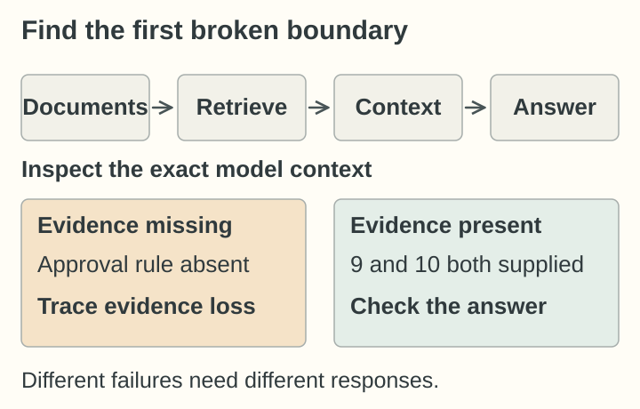
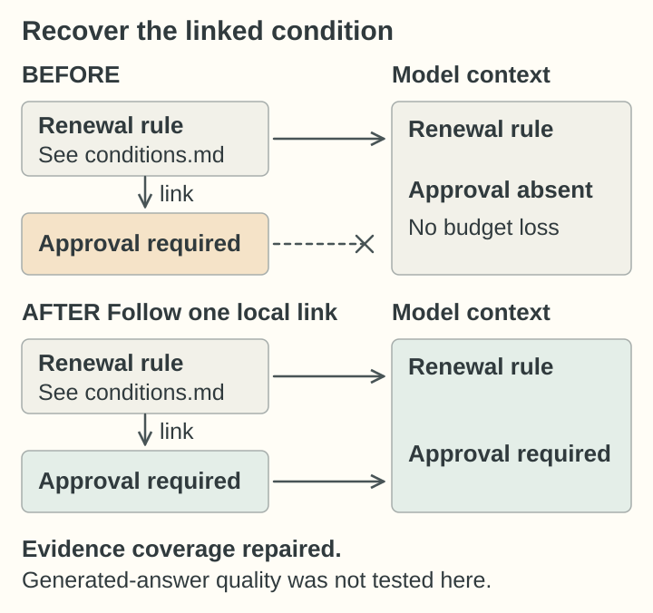
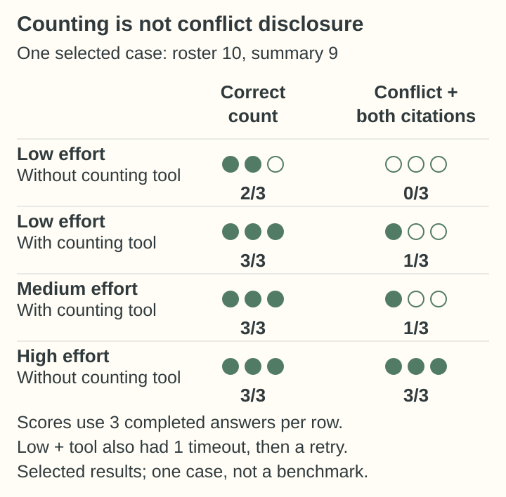

# Diagnosing retrieval and generation failures in RAG

[Inspect the code and run the examples](code/README.md) · [Recorded answers and checks](code/evidence/README.md)

## At a glance

**Project:** a small, agent-assisted document-answering system for a fictional workshop, built to learn retrieval-augmented generation without an orchestration framework or vector database.

**Question:** when an answer misses a condition or ignores a disagreement, did the system fail to supply the evidence—or did the model fail to use evidence it already had?

**Finding:** those failures needed different responses. Following a document link restored a missing condition. In a separate generation experiment, deterministic counting produced the correct number but did not reliably make the model disclose conflicting sources.

*First inspect the evidence supplied to the model: missing evidence and ignored evidence are different failures.*

## An inspectable document answering system

A workshop member asks about borrowing tools, access requirements or equipment use. The system searches local Markdown, assembles evidence under a character budget, and passes the question and evidence to an LLM. Answers must cite their factual claims, preserve conditions, abstain when support is missing, and report unresolved source disagreements.

The implementation uses Python's standard library for lexical retrieval, context selection and an adapter to the Codex CLI. Matching passages expand to their full source documents, preserving file and line references. The small synthetic corpus makes the evidence easy to inspect; this is a learning prototype, not a deployed workshop service.

The useful diagnostic boundary is the exact prompt: **was the necessary evidence present before the model answered?**

## Recovering a missing condition

*Following the document link restored the approval condition to context; this was an evidence-coverage check, not a generated-answer test.*

### A linked condition never reached the model

One reduced example used just two documents:

- A borrowing rule: “Members may renew drill loans subject to general conditions,” with a link to the conditions file.
- The linked condition: “Written approval from a steward is required.”

For “Can members renew drill loans?”, the borrowing rule reached the prompt but the approval condition did not. Raising the child-hit limit from 2 to 12 did not help; there were no context-budget exclusions. The linked condition did not share the query vocabulary.

A control made the distinction clear: moving the condition into a second paragraph of the borrowing file caused parent-document expansion to include it. Keeping it in a linked file lost it.

### Following the link restored the condition

Retrieval was extended to follow direct local Markdown links for one hop. The condition then reached the prompt without needing to match the question itself. This repaired an evidence-coverage gap; it did not establish how the model would answer or solve arbitrary cross-document dependencies.

## Handling conflicting evidence

### The answer got the count right but missed the conflict

A separate example asked: “How many listed members may operate the laser?”

The roster listed 16 members. Exactly **10** met both requirements: training and a steward's presence. A separate summary said **9**. Both sources reached the prompt, nothing was excluded by budget, and neither source established precedence. The answer contract required reporting the disagreement and citing both.

At low reasoning effort, one observed answer reported the correct roster count of 10 and cited the roster—but omitted the summary's conflicting 9.

This was not missing retrieval evidence or simply bad arithmetic. The answer failed to acknowledge evidence already supplied. A correct count and a valid citation were insufficient to satisfy the contract.

The larger failure example was reduced to 16 rows, the smallest version tested, before repeated comparisons.

### Testing higher reasoning effort and deterministic counting

The comparisons used `gpt-6-luna`, the same question and the same 16-row evidence. Assessment kept two outcomes separate: reporting the correct roster count, and explicitly disclosing the disagreement with both citations.

*The low-effort rows compare configurations from the same alternating-call batch. These are selected results; the [supporting experiment record](code/evidence/README.md) retains the full comparisons.*

High reasoning without tools met both criteria in all three repeats. The counting tool tested a different possibility: offload computation to ordinary code while leaving interpretation and source reconciliation to the model.

The tool counted rows matching model-selected column filters in the exact supplied evidence. It did not retrieve more documents, choose an authoritative source, or execute model-written code. Initially, merely making it available resulted in no use across three enabled calls; the later comparisons explicitly instructed the model to use it for table counts.

In all completed enabled calls in the final low- and medium-effort batches, the model selected the right filters and the tool returned 10. Yet only one of three answers per batch reported the conflicting summary. **Offloading the calculation worked; reliable conflict disclosure did not follow.**

## What the investigation established

The two examples distinguish three responsibilities: finding the evidence, computing from it, and representing it faithfully in the answer. Success at one boundary cannot stand in for checking the next.

The results supported retaining the existing high-reasoning, tools-off default for this case—not adding a counting tool by default or declaring the conflict problem solved. They are small exploratory comparisons on one selected synthetic failure, collected in separate batches, not a held-out benchmark or a general ranking of reasoning settings. Enabling the tool also changed the instruction. High reasoning with the tool was not tested.

The project stopped at a useful learning boundary: a repaired retrieval omission, a concrete generation failure, and a comparison showing both the value and the limits of deterministic computation.
